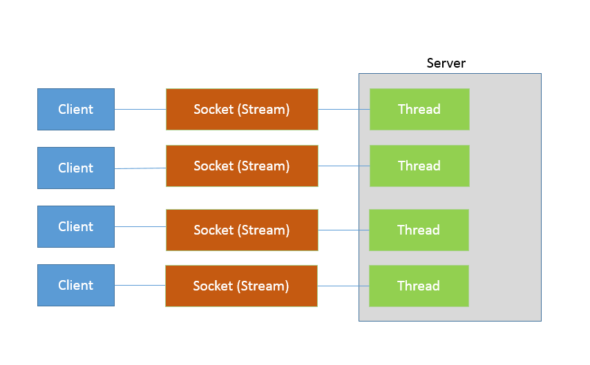
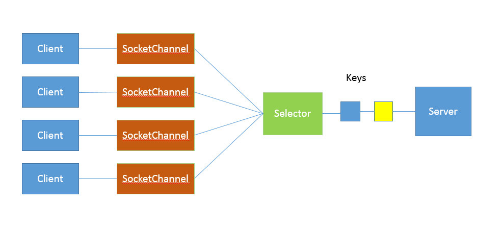

### Java 提供了哪些 IO 方式？ NIO 如何实现多路复用？

### 典型回答

Java IO 方式有很多种，基于不同的 IO 抽象模型和交互方式，可以进行简单区分。
- 第一，传统的 java.io 包，它基于流模型实现，提供了我们最熟知的一些 IO 功能，比如 File 抽象、输入输出流等。交互方式是同步、阻塞的方式，也就是说，在读取输入流或者写入输出流时，在读、写动作完成之前，线程会一直阻塞在那里，它们之间的调用是可靠的线性顺序。java.io 包的好处是代码比较简单、直观，缺点则是 IO 效率和扩展性存在局限性，容易成为应用性能的瓶颈。很多时候，人们也把 java.net 下面提供的部分网络 API，比如 Socket、ServerSocket、HttpURLConnection 也归类到同步阻塞 IO 类库，因为网络通信同样是 IO 行为。
- 第二，在 Java 1.4 中引入了 NIO 框架（java.nio 包），提供了 Channel、Selector、Buffer 等新的抽象，可以构建多路复用的、同步非阻塞 IO 程序，同时提供了更接近操作系统底层的高性能数据操作方式。
- 第三，在 Java 7 中，NIO 有了进一步的改进，也就是 NIO 2，引入了异步非阻塞 IO 方式，也有很多人叫它 AIO（Asynchronous IO）。异步 IO 操作基于事件和回调机制，可以简单理解为，应用操作直接返回，而不会阻塞在那里，当后台处理完成，操作系统会通知相应线程进行后续工作。
  
1. Java NIO概览
   ```cpp
   - Buffer，高效的数据容器，除了布尔类型，所有原始数据类型都有相应的 Buffer 实现。Channel，类似在 Linux 之类操作系统上看到的文件描述符，是 NIO 中被用来支持批量式 IO 操作的一种抽象。
   - File 或者 Socket，通常被认为是比较高层次的抽象，而 Channel 则是更加操作系统底层的一种抽象，这也使得 NIO 得以充分利用现代操作系统底层机制，获得特定场景的性能优化，例如，DMA（Direct Memory Access）等。不同层次的抽象是相互关联的，我们可以通过 Socket 获取 Channel，反之亦然。
   - Selector，是 NIO 实现多路复用的基础，它提供了一种高效的机制，可以检测到注册在 Selector 上的多个 Channel 中，是否有 Channel 处于就绪状态，进而实现了单线程对多 Channel 的高效管理。Selector 同样是基于底层操作系统机制，不同模式、不同版本都存在区别，例如，在最新的代码库里，相关实现如下：Linux 上依赖于epoll，Windows 上 NIO2（AIO）模式则是依赖于iocp。```
2. 
```Java
public class DemoServer extends Thread {
    private ServerSocket serverSocket;
    public int getPort() {
        return  serverSocket.getLocalPort();
    }
    public void run() {
        try {
            serverSocket = new ServerSocket(0);
            while (true) {
                Socket socket = serverSocket.accept();
                RequestHandler requestHandler = new RequestHandler(socket);
                requestHandler.start();
            }
        } catch (IOException e) {
            e.printStackTrace();
        } finally {
            if (serverSocket != null) {
                try {
                    serverSocket.close();
                } catch (IOException e) {
                    e.printStackTrace();
                }
                ;
            }
        }
    }
    public static void main(String[] args) throws IOException {
        DemoServer server = new DemoServer();
        server.start();
        try (Socket client = new Socket(InetAddress.getLocalHost(), server.getPort())) {
            BufferedReader bufferedReader = new BufferedReader(new                   InputStreamReader(client.getInputStream()));
            bufferedReader.lines().forEach(s -> System.out.println(s));
        }
    }
 }
// 简化实现，不做读取，直接发送字符串
class RequestHandler extends Thread {
    private Socket socket;
    RequestHandler(Socket socket) {
        this.socket = socket;
    }
    @Override
    public void run() {
        try (PrintWriter out = new PrintWriter(socket.getOutputStream());) {
            out.println("Hello world!");
            out.flush();
        } catch (Exception e) {
            e.printStackTrace();
        }
    }
 }

serverSocket = new ServerSocket(0);
executor = Executors.newFixedThreadPool(8);
 while (true) {
    Socket socket = serverSocket.accept();
    RequestHandler requestHandler = new RequestHandler(socket);
    executor.execute(requestHandler);
}
```


```Java
public class NIOServer extends Thread {
    public void run() {
        try (Selector selector = Selector.open();
             ServerSocketChannel serverSocket = ServerSocketChannel.open();) {// 创建Selector和Channel
            serverSocket.bind(new InetSocketAddress(InetAddress.getLocalHost(), 8888));
            serverSocket.configureBlocking(false);
            // 注册到Selector，并说明关注点
            serverSocket.register(selector, SelectionKey.OP_ACCEPT);
            while (true) {
                selector.select();// 阻塞等待就绪的Channel，这是关键点之一
                Set<SelectionKey> selectedKeys = selector.selectedKeys();
                Iterator<SelectionKey> iter = selectedKeys.iterator();
                while (iter.hasNext()) {
                    SelectionKey key = iter.next();
                   // 生产系统中一般会额外进行就绪状态检查
                    sayHelloWorld((ServerSocketChannel) key.channel());
                    iter.remove();
                }
            }
        } catch (IOException e) {
            e.printStackTrace();
        }
    }
    private void sayHelloWorld(ServerSocketChannel server) throws IOException {
        try (SocketChannel client = server.accept();) {          client.write(Charset.defaultCharset().encode("Hello world!"));
        }
    }
   // 省略了与前面类似的main
}
```



NIO2 异步IO，利用事件和回调，处理Accept，Read等操作。

```Java
AsynchronousServerSocketChannel serverSock =        AsynchronousServerSocketChannel.open().bind(sockAddr);
serverSock.accept(serverSock, new CompletionHandler<>() { //为异步操作指定CompletionHandler回调函数
    @Override
    public void completed(AsynchronousSocketChannel sockChannel, AsynchronousServerSocketChannel serverSock) {
        serverSock.accept(serverSock, this);
        // 另外一个 write（sock，CompletionHandler{}）
        sayHelloWorld(sockChannel, Charset.defaultCharset().encode
                ("Hello World!"));
    }
  // 省略其他路径处理方法...
});
```
多路复用器监控多个连接的I/O状态，并使用一个线程轮询这些连接，只有当连接有I/O事件时，才会使用线程进行具体的I/O操作。这种方式使得单个线程可以处理多个连接的I/O操作，极大地提高了并发性能。

在多线程和NIO结合的场景中，可以通过创建多个线程，每个线程运行一个NIO的多路复用器，来同时处理多个连接的I/O操作。每个NIO线程负责管理一部分连接，当有I/O事件触发时，NIO线程会进行相应的处理，实现高效的并发处理。

鉴于其编程要素（如 Future、CompletionHandler 等），我们还没有进行准备工作，为避免理解困难，我会在专栏后面相关概念补充后的再进行介绍，尤其是 Reactor、Proactor 模式等方面将在 Netty 主题一起分析，这里我先进行概念性的对比：基本抽象很相似，AsynchronousServerSocketChannel 对应于上面例子中的 ServerSocketChannel；AsynchronousSocketChannel 则对应 SocketChannel。业务逻辑的关键在于，通过指定 CompletionHandler 回调接口，在 accept/read/write 等关键节点，通过事件机制调用，这是非常不同的一种编程思路。

### mmap的使用

1. 打开文件
2. 创建映射
3. 对映射进行读写操作
4. 关闭映射
5. 关闭文件

```cpp
#include <stdio.h>
#include <fcntl.h>
#include <sys/mman.h>

int main() {
    int fd;
    char *data;

    // 打开文件
    fd = open("example.txt", O_RDWR);

    // 创建映射
    data = (char *)mmap(NULL, sizeof(char) * 1024, PROT_READ | PROT_WRITE, MAP_SHARED, fd, 0);
    
    // 对映射进行读写操作
    printf("Data: %s", data);
    sprintf(data, "Hello, mmap!");

    // 关闭映射
    munmap(data, sizeof(char) * 1024);

    // 关闭文件
    close(fd);

    return 0;
}
```

### 不使用mmap

1. 打开文件
2. 使用read 读取文件内容
3. 使用write 写入文件内容
4. 关闭文件

```cpp
#include <stdio.h>
#include <fcntl.h>
#include <unistd.h>

int main() {
    int fd;
    char buffer[1024];
    
    // 打开文件
    fd = open("example.txt", O_RDWR);
    if(fd == -1) {
        perror("Failed to open file");
        return -1;
    }
    
    // 读取文件内容
    ssize_t bytesRead = read(fd, buffer, sizeof(buffer));
    if(bytesRead == -1) {
        perror("Failed to read file");
        close(fd);
        return -1;
    }
    
    printf("Data: %s", buffer);
    
    // 写入文件内容
    const char* data = "Hello, read/write!";
    ssize_t bytesWritten = write(fd, data, strlen(data));
    if(bytesWritten == -1) {
        perror("Failed to write file");
        close(fd);
        return -1;
    }
    
    // 关闭文件
    close(fd);
    
    return 0;
}

```
### 使用mmap进行进程间共享

1. 创建共享内存对象
2. 设置共享内存对象的大小
3. 将共享内存对象映射到进程的虚拟地址空间
4. 进行进程间通信
5. 等待另一个进程完成通信
6. 从共享内存中读取数据
7. 解除映射
8. 关闭共享内存对象
9. 删除共享内存对象


```cpp
#include <stdio.h>
#include <stdlib.h>
#include <sys/mman.h>
#include <sys/stat.h>
#include <fcntl.h>
#include <unistd.h>
#include <string.h>
#include <semaphore.h>

#define SHARED_MEMORY_NAME "/my_shared_memory"
#define SHARED_MEMORY_SIZE 4096
#define SEMAPHORE_NAME "/my_semaphore"

int main() {
    int shm_fd;
    char *data;
    sem_t *semaphore;

    // Create and open shared memory object
    shm_fd = shm_open(SHARED_MEMORY_NAME, O_CREAT | O_RDWR, 0666);
    if (shm_fd == -1) {
        perror("Failed to create shared memory");
        return -1;
    }

    // Set the size of the shared memory object
    if (ftruncate(shm_fd, SHARED_MEMORY_SIZE) == -1) {
        perror("Failed to set shared memory size");
        shm_unlink(SHARED_MEMORY_NAME);
        return -1;
    }

    // Map the shared memory object into the virtual address space
    data = (char *)mmap(NULL, SHARED_MEMORY_SIZE, PROT_READ | PROT_WRITE, MAP_SHARED, shm_fd, 0);
    if (data == MAP_FAILED) {
        perror("Failed to map shared memory");
        shm_unlink(SHARED_MEMORY_NAME);
        return -1;
    }

    // Create or open the semaphore
    semaphore = sem_open(SEMAPHORE_NAME, O_CREAT, 0666, 0);
    if (semaphore == SEM_FAILED) {
        perror("Failed to create or open semaphore");
        munmap(data, SHARED_MEMORY_SIZE);
        shm_unlink(SHARED_MEMORY_NAME);
        return -1;
    }

    // Fork the process
    pid_t pid = fork();

    if (pid == -1) {
        perror("Failed to fork");
        return -1;
    } 

    // Child process
    if (pid == 0) {
        // Wait for the parent process to complete its communication
        sem_wait(semaphore);

        // Read the data from shared memory
        printf("Child process: Data: %s", data);

        // Modify the data in shared memory
        strcpy(data, "Modified data by child process");

        // Signal the parent process that communication is complete
        sem_post(semaphore);
    }
    // Parent process
     else {
        // Perform inter-process communication using shared memory
        sprintf(data, "Hello, shared memory!");

        // Signal the child process that communication is complete
        sem_post(semaphore);

       // Wait for the child process to complete its communication
        waitpid(pid, NULL, 0);
        // Wait for the child process to complete its communication
        sem_wait(semaphore);

        // Read the modified data from shared memory
        printf("Parent process: Data: %s", data);
    }

    // Unmap and close the shared memory object
    if (munmap(data, SHARED_MEMORY_SIZE) == -1) {
        perror("Failed to unmap shared memory");
        shm_unlink(SHARED_MEMORY_NAME);
        sem_close(semaphore);
        sem_unlink(SEMAPHORE_NAME);
        return -1;
    }

    // Close and unlink the semaphore
    sem_close(semaphore);
    sem_unlink(SEMAPHORE_NAME);

    // Remove the shared memory object from the system
    if (shm_unlink(SHARED_MEMORY_NAME) == -1) {
        perror("Failed to remove shared memory");
        return -1;
    }

    return 0;
}

```

CAP理论是分布式系统设计中的一个基本原则，它指出在一个分布式系统中，一致性（Consistency）、可用性（Availability）和分区容错性（Partition Tolerance）这三个目标是无法同时满足的。

在CAP理论中，P代表分区容错性（Partition Tolerance），即一个分布式系统要能够在各个节点之间进行通信，即使某些节点无法通信或者出现网络分区，仍然能够继续工作。

分布式系统在C（Consistency，一致性）和A（Availability，可用性）两个目标之间需要进行权衡。C意味着在系统中的所有节点上的数据副本保持一致，而A意味着系统能够在任何时间响应客户端的请求。

根据CAP理论，由于分区容错性已经是分布式系统设计的必要条件，所以在C和A之间只能选择其中一个，并且不同的应用场景可能会偏向其中之一。

对于CP（Consistency and Partition Tolerance）模型，系统在面对网络分区时，会牺牲可用性，即请求可能会受到延迟或者无法响应，但是系统保证了数据的一致性，适用于对数据一致性要求较高的应用场景，如金融系统或者电商系统。

对于AP（Availability and Partition Tolerance）模型，系统在面对网络分区时，仍然保留了可用性，即能够对客户端请求进行响应，但是无法保证数据的一致性，适用于对系统可用性要求较高的应用场景，如社交网络或者新闻网站。

根据实际应用场景，我们可以根据对一致性和可用性的需求进行权衡，并选择CP或者AP模型。例如，对于一个有严格事务要求的金融系统，可能更倾向于选择CP模型，而对于一个高并发的社交网络，可能更倾向于选择AP模型。